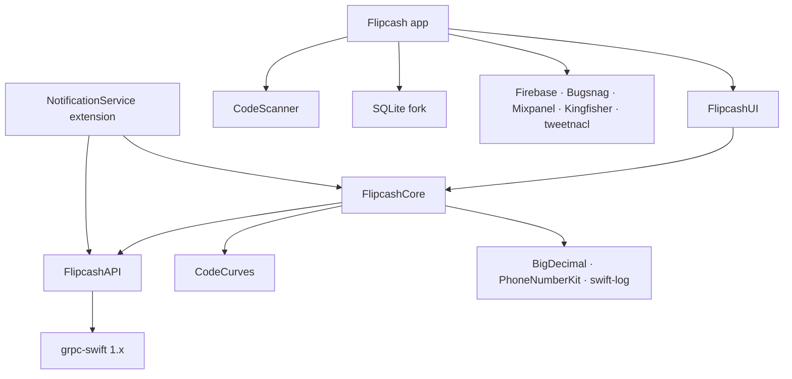

# Modules & Boundaries

The codebase is split into 5 SPM packages plus the app target and one app extension (NotificationService); a share helper is embedded in the app target rather than being its own target. The split enforces a strict, acyclic dependency layering: business logic never imports UI, UI never imports the network layer, and generated code is isolated behind one package.

## Module inventory

| Module | Type | Purpose | ~Files |
|--------|------|---------|--------|
| **CodeCurves** | SPM package | Ed25519 crypto — pure-C implementation (zero Swift; the `KeyPair` wrapper lives in FlipcashCore) | ~18 C/h |
| **CodeScanner** | SPM package | C++/OpenCV "Kik Code" circular-2D encode/decode/scan; bundles OpenCV 4.10 | ~12 C++ + bridge |
| **FlipcashAPI** | SPM package | **All** generated gRPC/protobuf Swift bindings (both backends) | ~45 (100% generated) |
| **FlipcashCore** | SPM package | Business logic, models, gRPC service wrappers, logging, validation, formatters — **no SwiftUI** | ~216 |
| **FlipcashUI** | SPM package | Reusable SwiftUI/UIKit components + design tokens — **no networking/persistence** | ~78 |
| **Flipcash** | Xcode app target | Screens, navigation, controllers (Database, Session, Rates…), 3rd-party SDKs | ~205 |
| **NotificationService** | Xcode extension | `UNNotificationServiceExtension` — resolves contact names on-device, renders communication notifications | 1 |
| **Flipcash/Share** | Files in app target | System share-sheet wrapper (`UIActivityViewController`) for cash links | 2 |
| **FlipcashTests** | Xcode test target | Unit/integration tests (Swift Testing) for app + Core | ~118 |
| **FlipcashUITests** | Xcode test target | Black-box XCUITest smoke tests | ~35 |

## Dependency graph

*Arrows point to dependencies; the graph is acyclic.*

### Third-party dependencies (where they live)

| Dependency | Pin | Used by |
|------------|-----|---------|
| grpc-swift | ≥1.22 (**v1, not v2**) | FlipcashAPI |
| swift-log | ≥1.6 | FlipcashCore |
| BigDecimal | ≥3.0.2 | FlipcashCore (quark/fiat math) |
| PhoneNumberKit | ≥4.1.4 | FlipcashCore |
| SQLite.swift (**dbart01 fork**, `master`) | — | app only |
| Firebase, Bugsnag, Mixpanel, Kingfisher, tweetnacl | various | app only |
| opencv2 (bundled XCFramework) | ~4.10 | CodeScanner only |

The observability/analytics SDKs (Firebase, Bugsnag, Mixpanel) are confined to the **app target** — they never leak into Core or UI.

## Boundary rules (enforced by convention)

- **`FlipcashAPI/**/Generated/` is never hand-edited.** Regenerate via `Scripts/run -a flipcashPayments` / `flipcashCore`. Edits are overwritten. Wrap generated stubs in hand-written service files instead.
- **FlipcashCore is SwiftUI-free** — zero `import SwiftUI`. Models, clients, logging, validation, formatting only. Anything UI-facing crosses into FlipcashUI or the app.
- **FlipcashUI has no business logic** — it imports FlipcashCore for *model types and formatters* only. No network calls, no session state, no persistence.
- **SQLite belongs to the app layer only** — `import SQLite` appears exclusively under `Flipcash/Core/Controllers/Database/`. Core has no SQLite dependency.
- **CodeScanner is used at exactly two call sites** (`CodeExtractor.swift`, `CashCode.Payload+Encoding.swift`); it never reaches Core or UI.
- **Directory placement**: screens → `Flipcash/Core/Screens/`; domain models → `FlipcashCore/.../Models/`; DB row models → `Flipcash/Core/Controllers/Database/Models/`; test support → `FlipcashTests/TestSupport/`.

## Embedded targets

- **NotificationService** — runs in a tight memory/time budget. Server pushes E.164 numbers + positional placeholders; the extension queries `CNContactStore` to resolve names, and renders "Sent You Cash" pushes as `INSendMessageIntent` communication notifications (sender avatar in the banner). Imports FlipcashCore + FlipcashAPI only.
- **Share** — `ShareCashLinkItem` (`UIActivityItemSource` providing a cash-link URL) + `ShareSheet` (`UIViewControllerRepresentable` over `UIActivityViewController`). Embedded in the app target, not a separate bundle.

## Why this matters

The layering is the single biggest structural guarantee in the project: because Core can't import UI and the app can't reach into generated code, a change to a proto, a UI component, or a screen each has a bounded blast radius. Keep new code on the right layer — that's what keeps the graph acyclic.
