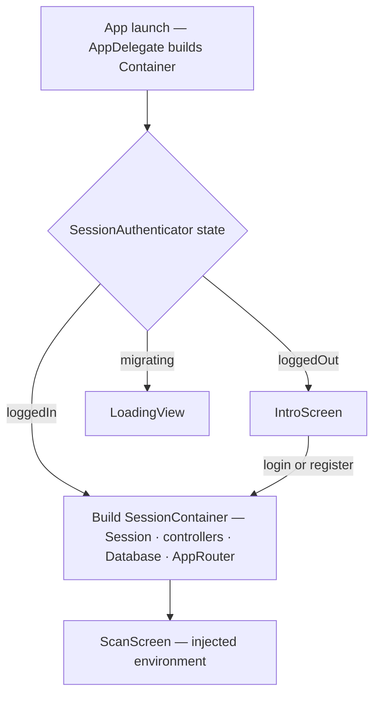

# State & Dependency Injection

The app has two DI scopes: a process-wide `Container` (always present) and a per-login `SessionContainer` (present only when authenticated). State is held in `@Observable` objects injected through the SwiftUI environment. `Session` is the central post-login state object.



## The two containers

### `Container` — pre-auth scope
`Flipcash/Core/Container.swift`. An `@Observable class` (not a singleton), constructed once in `AppDelegate.init()` and passed by reference for the app's lifetime.

Holds: `client: Client` (gRPC payments), `flipClient: FlipClient` (Flipcash API), `accountManager` (Keychain), `betaFlags`, `preferences`, `notificationController`, `cameraSession`, and lazily the `sessionAuthenticator` + `deepLinkController`.

Injected in `FlipcashApp` via `.injectingEnvironment(from: container)` — `.environment(self)` (read with `@Environment(Container.self)`), `.environmentObject(client/flipClient)` (legacy), plus `.environment(...)` for `sessionAuthenticator`, `betaFlags`, `preferences`, and `notificationController`. `cameraSession` and `deepLinkController` are held by `Container` but accessed by direct reference, not through the environment.

### `SessionContainer` — post-auth scope
Defined in `SessionAuthenticator.swift`. An **`@Observable final class`**, created by `SessionAuthenticator.createSessionContainer(...)` after login, stored in `state = .loggedIn(sessionContainer)`, and itself injected via `.environment(self)` (read with `@Environment(SessionContainer.self)`).

Composition tree (everything `@Observable` unless noted):

```
SessionContainer (@Observable class)
├── session: Session                    main per-login state
├── database: Database                  SQLite (plain class; not in environment)
├── flipClient: FlipClient              shared Flipcash API client (legacy ObservableObject; not in env)
├── appRouter: AppRouter                @MainActor; navigation truth
├── ratesController                     verified rate/reserve proofs + live streams
├── historyController                   activity history sync
├── pushController                      APNs token registration
├── contactSyncController               contact upload + match
├── conversationController              @MainActor; DM feed + per-user chat event stream
├── chatSpotlightIndexer                mirrors DM chats into Spotlight (@MainActor class; not in env)
├── walletConnection                    external-wallet sessions
├── verificationCoordinator             phone/email verification
├── coinbaseService                     Coinbase onramp orders
├── onrampDeeplinkInbox                 onramp deeplink callbacks
├── usdcSweepOperation                  USDC→USDF sweep (actor; not in env; called from AppDelegate)
└── quickActionsController              Home Screen shortcuts (@MainActor class; not in env)
```

`Database`, `usdcSweepOperation`, `quickActionsController`, and `chatSpotlightIndexer` are accessed directly (via `AppDelegate.sessionContainer` or by their owners), not the environment.

## `Session` — the main state object

`Flipcash/Core/Session/Session.swift`. `@Observable class`, injected via `.environment(session)`, read with `@Environment(Session.self)` or `@Bindable var session`.

Responsibility buckets:

| Bucket | Examples |
|--------|----------|
| Identity | `owner: AccountCluster`, `userID`, `ownerKeyPair` |
| Balances | `balances`, `totalBalance`, `balance(for:)`, `hasSufficientFunds(for:)` |
| Limits | `limits`, `sendLimitFor(currency:)` |
| Profile & flags | `profile`, `userFlags`, `syncUserPreferences()` |
| UI presentation | `billState`, `toast`, `dialogItem`, `isShowingBillDesigner` |
| Cash bill / ops | `scanOperation`, `sendOperation`, `showCashBill(_:)`, `receiveCash`, `dismissCashBill` |
| Transactions | `buy`, `sell`, `withdraw`, `launchCurrency`, `resolveContact`, `send` (carries an optional `ChatPaymentMetadata` so a contact payment lands in its DM chat) |
| Lifecycle | `didBecomeActive()`, `didEnterBackground()`, `updatePostTransaction()` |

DB-backed properties use an `Updateable<T>` wrapper that re-reads the query on `.databaseDidChange` and republishes into a tracked slot — SwiftUI refreshes without polling. Private deps (`client`, `database`, `ratesController`, …) are `@ObservationIgnored`.

### Don't grow `Session` flatly
`Session` is already large and is the app's API surface for **network/transaction** work — not a junk drawer. New concerns go to:
- a **sibling controller on `SessionContainer`** (preferred for non-transactional concerns), or
- a **namespaced service composed inside `Session`** (acceptable for transactional concerns: `session.foo.bar()`).

## Auth & login lifecycle

`SessionAuthenticator` (`@Observable`). States: `.migrating` (initial) → `.loggedOut` / `.loggedIn(SessionContainer)`. (A `.pending` case exists in the enum and is handled by `ContainerScreen`, but is currently never assigned.)

- **Auto-login** (non-test): reads `UserAccount` from Keychain via `AccountManager`; if present, `completeLogin` directly (no network). Otherwise falls back to the historical account — if present, runs `flipClient.login` + `client.createAccounts` once. If `wasLoggedIn` is true but the Keychain hasn't decoded the historical account yet, the *lookup* is retried up to 6× with 1s delays.
- **`completeLogin`** derives `owner: AccountCluster` from the mnemonic, runs `initializeDatabase(owner:)` (version-gates the SQLite store — see [05](05-persistence.md)), constructs the controllers + `Session`, fires `historyController.sync()` and — only if the stored profile already has a verified phone — `contactSyncController.activate()`, then sets `.loggedIn`. `SessionContainer.init` starts `conversationController` and `chatSpotlightIndexer`; `logout()` stops both and clears the cached notification previews.
- **Background polling**: a 30s `Poller` checks `fetchUnauthenticatedUserFlags` (force-upgrade gate) and `checkForUnusableAccount` (force-logout gate).

`AccountManager` (`Flipcash/Core/Session/AccountManager.swift`) owns two Keychain slots: the current `UserAccount` and an iCloud-synced `historicalAccounts` map (multi-account). Logout nils the current account; historical is preserved.

### Environment split: dev | prod
There are only two environments — **dev** and **prod**. There is no staging. `Client`/`FlipClient` are constructed with a fixed network at `Container.init`.

## App lifecycle

- `FlipcashApp` (`@main`) hosts `AppDelegate` via `@UIApplicationDelegateAdaptor`; root is `ContainerScreen`.
- `ContainerScreen` switches on `SessionAuthenticator.state`: `.loggedOut → IntroScreen`, `.migrating/.pending → LoadingView`, `.loggedIn → ScanScreen`. `requiresUpgrade` / `requiresForceLogout` take priority.
- **scenePhase handlers are single-line fire-and-forgets.** Each case in `AppDelegate.scenePhaseChanged` is a one-liner optional-chain call (`session.didBecomeActive()`, `usdcSweepOperation.start()`, …). Multi-step async work is encapsulated inside the callee (e.g. `UsdcSweepOperation.start()` spawns its own `Task`) — never inlined into the switch.

## Observation model

| Type | System | Injection |
|------|--------|-----------|
| `Client`, `FlipClient` | `ObservableObject` (legacy) | `.environmentObject` |
| `Container`, `SessionContainer`, `Session`, `AppRouter`, `RatesController`, `SessionAuthenticator`, all new controllers | `@Observable` | `.environment` |

`Client`/`FlipClient` stay `ObservableObject` until all their `@EnvironmentObject` consumers migrate. **A single class must use one system** — mixing `@Observable` with `@Published` causes silent observation failures. New code uses `@Observable` + `@Environment`.
