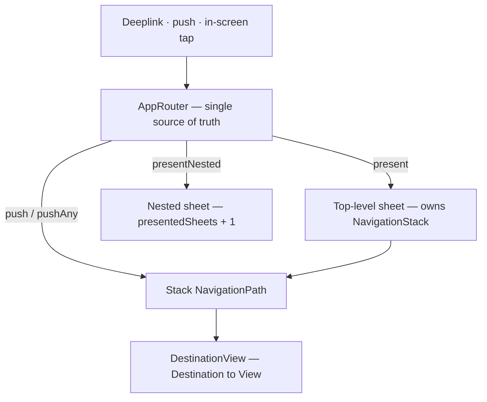

# Navigation

All navigation flows through a single `AppRouter` — there are no screen-level sheet flags or `selectedXxx` bindings. The router is the source of truth for which sheets are presented and what's on each sheet's stack.

## `AppRouter`

`Flipcash/Core/Navigation/AppRouter.swift`. `@Observable @MainActor final class` on `SessionContainer`, injected via `@Environment(AppRouter.self)`. Every mutation logs one INFO entry under the **`flipcash.router`** label — filter by it to trace any navigation interaction.

Core mutators:

| Mutator | Purpose |
|---------|---------|
| `navigate(to: Destination)` | Cross-stack: present the destination's owning sheet, set it as the sole path entry. Used by deeplinks/push. |
| `push(_ destination)` | Push a typed `Destination` onto the topmost stack. |
| `pushAny(_ value: Hashable)` | Push any sub-flow value (`WithdrawNavigationPath`, `BuyFlowPath`) onto the topmost stack. |
| `replaceTopmostAny(_:)` | Atomic pop+push for screen-swap handoffs. |
| `present(_ sheet)` | Present a root sheet (handles swaps + path-clear-on-reopen). |
| `presentNested(_ sheet)` | Stack a sheet on top of the current top. |
| `dismissSheet()` / `dismissAll()` | Pop the topmost / tear down the entire chain (auto-return). |

## Destinations

`AppRouter+Destination.swift` — `enum Destination: Hashable, Sendable`. Every push-reachable screen is a case, grouped by `owningStack`:

- **`.balance`** — `currencyInfo(mint)`, `currencyInfoForDeposit(mint)`, `discoverCurrencies`, `currencyCreationSummary`, `currencyCreationWizard`, `transactionHistory(mint)`, `give(mint)`, `withdrawCurrency(mint)`, `usdcDepositAddress`, `phantomFlow(...)`, …
- **`.settings`** — `settingsMyAccount`, `settingsAppSettings`, `settingsAdvancedFeatures`, `settingsBetaFlags`, `accessKey`, `deposit`, `depositAddress(mint)`, `withdraw`, …
- **`.send`** — `sendAmount(contact:)`

`AppRouter+DestinationView.swift` (`DestinationView`) is the single exhaustive `Destination → View` map. Screens whose case can recur with a different payload (`currencyInfo`, `give`, `sendAmount`) apply `.id(value)` so a cross-stack `navigate` forces fresh view identity (otherwise SwiftUI keeps the stale leaf's `@State`).

## Top-level sheets

`AppRouter+SheetPresentation.swift` — `enum SheetPresentation`. Each owns a `NavigationStack(path: $router[.<stack>])`:

| Sheet | Stack | Notes |
|-------|-------|-------|
| `.balance` | `.balance` | Portfolio / token browsing |
| `.settings` | `.settings` | Account settings |
| `.give` | `.give` | Give cash (gated on `hasGiveableBalance`) |
| `.discover` | `.discover` | Currency discovery |
| `.buy(mint)` | `.buy` | **Nested-only** — `Stack.buy.sheet` is `nil` because the mint can't be synthesized from the stack |
| `.send` | `.send` | Send flow (flag-gated) |
| `.downloadApp` | `.downloadApp` | Full-screen overlay over the scanner |

Each sheet root applies `.appRouterDestinations(...)` (registers `.navigationDestination(for: Destination.self)`). The `RoutedSheet` container inside `ScanScreen` applies `.appRouterNestedSheet(...)` **once**, enabling nested sheets for whichever root sheet is currently showing.

## Per-stack paths & sub-flows

`AppRouter` stores `paths: [Stack: NavigationPath]`. Because `NavigationPath` is type-erased, one stack carries both `Destination` cases (via `push`) and arbitrary `Hashable` sub-flow values (via `pushAny`) — e.g. `WithdrawNavigationPath` on `.settings`, `BuyFlowPath` on `.buy`. Sub-flow roots register their own `.navigationDestination(for: SubFlowPath.self)`.

> **Hard rule: never nest a `NavigationStack` inside another stack's destination.** Push/pop/push corrupts SwiftUI's stack state with `comparisonTypeMismatch`. Drop the inner stack and register the sub-flow's destinations on the destination's root view.

## Nested sheets

`presentedSheets: [SheetPresentation]` is an ordered stack: index 0 is the root (mounted at app root), index 1+ stack visually on top. `AppRouter+NestedSheet.swift` provides `.appRouterNestedSheet(...)`, which reads `@Environment(\.nestedSheetDepth)` and binds `presentedSheets[depth+1]` to a `.sheet(item:)`. SwiftUI requires nested sheets to be mounted **inside** the parent sheet's content tree (sibling `.sheet` modifiers at the root can't stack) — hence the modifier lives in each sheet's content. The buy flow (`.buy(mint)`) is the only nested sheet today.

## Deeplinks & push-driven navigation

`Flipcash/Core/Controllers/Deep Links/`. `AppDelegate.handleOpenURL` → `DeepLinkController.handle(open:)` parses a `Route` (normalizes Universal Links and the `flipcash://` scheme). Examples:

| Path | Action |
|------|--------|
| `/login#e=<entropy>` | already logged-in → `session.attemptLogin` (confirm, then `switchAccount`); else `switchAccount` directly |
| `/cash#e=<entropy>` | `session.receiveCashLink(mnemonic:)` |
| `/token/<mint>` | `appRouter.navigate(to: .currencyInfo(mint))` |
| `/give`, `/balance`, `/discover`, `/send` | `appRouter.present(sheet)` (gated where relevant) |

Push notifications route through the same URL mechanism. Auto-return is consumed atomically before deeplink navigation so `dismissAll` can't clobber a concurrent `navigate`.

## Sheet lifecycle

- `dismissSheet()` pops the top sheet but leaves its `NavigationPath` populated so the close animation runs with contents intact; the path clears on the next `present`/`presentNested` of that stack (re-opens land at root).
- Swapping root sheets (`present(.other)` without an intervening `dismissSheet`) preserves the swapped-out path for swap-back.
- `dismissAll()` clears inactive stacks then calls UIKit `dismiss(animated:)` so the whole nested chain tears down in one animation.
- **Don't add manual `popToRoot` calls around your own dismissal** — let the router handle it.

## When is it a router destination?

> **The test:** if a deeplink could reasonably land the user here, it's a destination — route through `AppRouter`. If not, keep it local.

- **Route via AppRouter**: deeplinkable screens; any full-screen overlay over `ScanScreen` (gets the 5-minute auto-return for free — `DownloadAppScreen` is canonical); multi-step sheet flows (push sub-steps).
- **Keep local**: transient pickers (currency/funding selection) and operation-bound processing modals — they're interactions, not navigation. Unless the modal belongs to a router-managed sheet's flow, in which case push it onto that sheet's stack.
