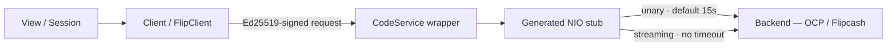

# Networking

The app speaks gRPC to two backends and JSON-RPC to Solana. Generated stubs are wrapped by hand-written service classes; every request is self-authenticating via an Ed25519 signature in the payload (no auth tokens). All cached responses land in SQLite.



## Transport: two gRPC channels

| Client | Backend | Host | Owns |
|--------|---------|------|------|
| `Client` | Payments / OCP server | `ocp-v2.api.flipcash-infra.net:443` | On-chain transfers, account creation, messaging (rendezvous), swap orchestration |
| `FlipClient` | Flipcash core server | `fc-v2.api.flipcash-infra.net:443` | Identity, activity, push tokens, contacts, profile, settings, moderation |

Both `@MainActor ObservableObject`, both built from `ClientConnection.appConnection(host:port:)` (`Client.swift`): TLS via NIO SSL, keepalive 30s/10s with `permitWithoutCalls`, 5-minute idle timeout, errors logged to `flipcash.grpc`. `mainNet`/`testNet` currently point at the same live hosts (no staging).

## Service layer

Pattern: **generated `*NIOClient` stub → `CodeService<T>` subclass → method on `Client`/`FlipClient`**.

`CodeService<T>` (`CodeService.swift`) is a generic base holding the connection, a `DispatchQueue`, and the generated stub (configured with `defaultCallOptions: .default` + `InterceptorFactory()`). Concrete services subclass it: `TransactionService`, `CurrencyService`, `MessagingService`, `AccountInfoService`, `SwapService` (payments side); `AccountService`, `PushService`, `ActivityService`, `PhoneService`, `EmailService`, `ProfileService`, `SettingsService`, `ModerationService`, `ThirdPartyService`, plus `ContactListService` / `ResolverService` *(contact-sync)* (Flipcash side). Unary calls dispatch their result back onto the capture queue via a `handle(on:success:failure:)` helper.

## CallOptions — the 15s trap

`CodeService.swift`:

```swift
extension CallOptions {
    static let `default`  = CallOptions(timeLimit: .timeout(.seconds(15)))  // unary
    static let streaming  = CallOptions(timeLimit: .none)                   // streaming
}
```

Stubs default to `.default`, so unary calls get the 15s deadline automatically. **Streaming RPCs must explicitly pass `callOptions: .streaming`** — omitting it silently kills the long-lived stream after 15s. The streaming RPCs:

| RPC | Service | Type |
|-----|---------|------|
| `openMessageStream` | Messaging | server-streaming |
| `submitIntent` | Transaction | bidirectional |
| `statefulSwap` / `statelessSwap` | Swap | bidirectional |
| `streamLiveMintData` | Currency (via `LiveMintDataStreamer`) | bidirectional |

## Streaming patterns

- **Message stream** (`openMessageStream`) — the give/grab rendezvous channel. Auto-reconnects on `.unavailable`. Drives `SendCashOperation`/`ScanCashOperation`.
- **Intent submission** (`submitIntent`) — bidirectional handshake: client `submitActions` → server `serverParameters` → client `submitSignatures` → server `success`/`error`. Uses a `BidirectionalStreamReference` with a deliberate retain so callers needn't hold the stream; released on completion.
- **Stateful swap** (`statefulSwap`) — same retain pattern; `initiate` → `serverParameters` → `submitSignatures` → `success`. Three server-parameter variants (reserve-existing, reserve-new, stablecoin).
- **Live mint data** (`streamLiveMintData`) — a Swift `actor`. Subscription updates reuse the open stream; ping/pong keepalive; exponential backoff reconnect (1s→30s); a generation counter prevents stale callbacks from tearing down a newer stream. Feeds verified rate/reserve protos to `VerifiedProtoService`.

## Auth on the wire — signature-per-request

There is **no auth token, cookie, or bearer header**. Every request authenticates itself:

- **Payments (OCP)**: each request has a `signature` field. `SwiftProtobuf.Message.sign(with: KeyPair)` serializes the proto and signs it with the owner's Ed25519 key (CodeCurves).
- **Flipcash (Core)**: requests carry a `Flipcash_Common_V1_Auth` (public key + signature) built by `KeyPair.authFor(message:)`.

The only interceptor is `UserAgentInterceptor` (adds a `User-Agent` header — `OpenCodeProtocol/iOS/...` for OCP paths, `Flipcash/iOS/...` otherwise).

## Solana RPC

Separate from gRPC. `SolanaRPC` (JSON-RPC 2.0 over `URLSession`, default `api.mainnet-beta.solana.com`): `getLatestBlockhash`, `sendTransaction`, `simulateTransaction`. Used by the external-wallet (Phantom) onramp to submit stateless-swap transactions that bypass the Code VM. All transaction *building* and key derivation is pure local logic in `FlipcashCore/Solana/` (no network).

## Push notifications

`FlipcashCore/.../Push/`: `NotificationPayload` decodes a base64 `Flipcash_Push_V1_Payload` from `userInfo` (key `flipcash_payload`); `SubstitutionApplier` fills `{0}`/`{1}` placeholders (resolved contact names). APNs tokens registered via `PushService` (`addToken`/`deleteTokens`). The NotificationService extension *(contact-sync)* resolves names on-device (see [01](01-modules-and-boundaries.md)).

## Generated code

`FlipcashAPI/Sources/FlipcashAPI/` holds both proto trees: **`Payments/`** (namespace `ocp.*`: account, currency, messaging, transaction) and **`Core/`** (namespace `flipcash.*`: account, activity, contact, email, phone, profile, push, resolver, settings, moderation, …), each with a `Generated/` subdir. Regenerate via `Scripts/run -a flipcashPayments` / `flipcashCore` (needs `protoc`, `protoc-gen-swift`, `protoc-gen-grpc-swift` **v1.x**). Never edit `Generated/` by hand.

> The repo root also contains an empty `FlipcashCoreAPI/` directory. It is a legacy placeholder with no sources — all core bindings live under `FlipcashAPI/Sources/FlipcashAPI/Core/`.
