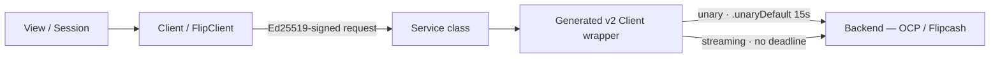

# Networking

The app speaks gRPC (grpc-swift 2: `GRPCCore` + the Network.framework `TransportServices` transport) to two backends and JSON-RPC to Solana. Generated stubs are wrapped by hand-written service classes; every request is self-authenticating via an Ed25519 signature in the payload (no auth tokens). All cached responses land in SQLite.



## Transport: two gRPC channels

| Client | Backend | Host | Owns |
|--------|---------|------|------|
| `Client` | Payments / OCP server | `ocp-v2.api.flipcash-infra.net:443` | On-chain transfers, account creation, messaging (rendezvous), swap orchestration |
| `FlipClient` | Flipcash core server | `fc-v2.api.flipcash-infra.net:443` | Identity, activity, push tokens, contacts, chat, profile, settings, moderation |

Both `@MainActor ObservableObject`, both built the same way (`Client.swift` / `FlipClient.swift`): `GRPCTransport.makeTransportServices(host:port:)` (`GRPCTransport.swift`) builds an `HTTP2ClientTransport.TransportServices` (aliased `AppTransport`) — TLS via the system trust store, keepalive 30s/10s permitted without calls, 5-minute idle timeout — and it's wrapped in a `GRPCClient` with the shared `UserAgentClientInterceptor`. The client does nothing until `runConnections()` is running; that loop lives in a retained `connectionTask` — dropping it makes the client inert and every RPC hangs. `deinit` calls `beginGracefulShutdown()` (drains in-flight streams) then cancels the task. `Network` has a single `.mainNet` case pointing at the live hosts (no staging).

## Service layer

Pattern: **generated `*.Client<AppTransport>` wrapper → `Sendable` service class → method on `Client`/`FlipClient`**.

There is no shared base class — each service wraps the shared `GRPCClient<AppTransport>` in its generated client (e.g. `Ocp_Transaction_V1_Transaction.Client(wrapping: client)` in `TransactionService`). Payments side: `AccountInfoService`, `TransactionService` (owns `SwapService`), `CurrencyService`, `MessagingService`, plus the `LiveMintDataStreamer` / `VerifiedProtoService` actors. Flipcash side: `AccountService`, `ActivityService`, `PushService`, `ThirdPartyService`, `PhoneService`, `EmailService`, `ProfileService`, `SettingsService`, `ModerationService`, `ContactListService`, `ResolverService`, `ChatService` (DM feed, chat lookup), `ChatMessagingService` (messages, send, read pointers, typing), and `EventStreamingService` behind the `EventStreamer` actor. Unary calls run in a `Task`, `await` the generated method with `options: .unaryDefault`, and deliver their completion back on the main actor.

`ChatNotificationClient` (`Clients/Chat/`) is a lean standalone façade for the NotificationService extension: its own `GRPCClient` + `ChatMessagingService`, no `FlipClient`/`Client`/`Database` graph; mint metadata is fetched over a transient second connection rather than a resident one.

## CallOptions — the 15s trap

`GRPCTransport.swift`:

```swift
extension CallOptions {
    static var unaryDefault: CallOptions {      // unary: 15s deadline
        var options = CallOptions.defaults
        options.timeout = .seconds(15)
        return options
    }
}
```

Deadlines are per-call in v2 — nothing is inherited from the stub. **Unary calls must pass `options: .unaryDefault`** so they fail fast on a dead connection; **streaming calls pass nothing** (`.defaults`, no deadline) — a stray deadline silently kills the long-lived stream after 15s. The streaming RPCs:

| RPC | Service | Type |
|-----|---------|------|
| `openMessageStream` | Messaging | server-streaming |
| `submitIntent` | Transaction | bidirectional |
| `statefulSwap` / `statelessSwap` | Swap | bidirectional |
| `streamLiveMintData` | Currency (via `LiveMintDataStreamer`) | bidirectional |
| `streamEvents` | EventStreaming (via `EventStreamer`) | bidirectional |
| `discover` | Currency | server-streaming |
| `getFlipcashContacts` | ContactList | server-streaming |

## Streaming patterns

v2 streaming is closure-scoped — the `RPCWriter` only exists inside the call's `requestProducer` closure. The adapters in `GRPCStream.swift` bridge that to the retained, multi-sender handle the consumers need:

- **`BidirectionalGRPCStream<Request, Response>`** — buffers outbound messages through an `AsyncStream` that the `requestProducer` drains; the call runs in a retained `Task`. `sendMessage(_:)` is safe from any point after `open`; `cancel()` closes the outbound side and cancels the call, suppressing `onComplete` (explicit teardown is not a stream error). `onComplete` otherwise fires exactly once with the terminal result.
- **`ServerGRPCStream`** — no outbound writer, just a retained cancellable `Task` iterating inbound messages. Re-openable on the same handle (a generation counter stops a superseded connection from firing a stale completion); `cancel()` is sticky.

The consumers:

- **Message stream** (`openMessageStream`) — the give/grab rendezvous channel. Auto-reconnects on `.unavailable` by re-opening the same `ServerGRPCStream`. Drives `SendCashOperation`/`ScanCashOperation`.
- **Intent submission** (`submitIntent`) — bidirectional handshake: client `submitActions` → server `serverParameters` → client `submitSignatures` → server `success`/`error`.
- **Stateful swap** (`statefulSwap`) — `initiate` → `serverParameters` → `submitSignatures` → `success`. Three server-parameter variants (reserve-existing, reserve-new, stablecoin).
- **Live mint data** (`streamLiveMintData`) — `LiveMintDataStreamer`, a Swift `actor`. Subscription updates reuse the open stream; ping/pong keepalive; exponential backoff reconnect (1s→30s); a generation counter prevents stale callbacks from tearing down a newer stream. Feeds verified rate/reserve protos to `VerifiedProtoService`.
- **Event stream** (`streamEvents`) — `EventStreamer`, an `actor` with the same ping/backoff/generation shape. The single per-user chat event stream (new messages, conversation metadata, read pointers), surfaced as an `AsyncStream<ConversationStreamEvent>`; started on login, stopped on logout.

A failed RPC classifies transport weather via `TransportClassifiableError` (`FlipcashCore/Models/`): typed error enums map an `RPCError` to a `.transportFailure` case with the shared `from(transportError:)` helper, so timeouts and dead channels report as `.suppressed` instead of Bugsnag errors — see [09](09-cross-cutting-concerns.md).

## Auth on the wire — signature-per-request

There is **no auth token, cookie, or bearer header**. Every request authenticates itself:

- **Payments (OCP)**: each request has a `signature` field. `SwiftProtobuf.Message.sign(with: KeyPair)` serializes the proto and signs it with the owner's Ed25519 key (CodeCurves).
- **Flipcash (Core)**: requests carry a `Flipcash_Common_V1_Auth` (public key + signature) built by `KeyPair.authFor(message:)`.

The only interceptor is `UserAgentClientInterceptor` (registered on each `GRPCClient`; adds a lowercase `user-agent` header — `OpenCodeProtocol/iOS/...` for `ocp.*` services, `Flipcash/iOS/...` otherwise).

## Solana RPC

Separate from gRPC. `SolanaRPC` (JSON-RPC 2.0 over `URLSession`, default `api.mainnet-beta.solana.com`): `getLatestBlockhash`, `sendTransaction`, `simulateTransaction`. Used by the external-wallet (Phantom) onramp to submit stateless-swap transactions that bypass the Code VM. All transaction *building* and key derivation is pure local logic in `FlipcashCore/Solana/` (no network).

## Push notifications

`FlipcashCore/.../Push/`: `NotificationPayload` decodes a base64 `Flipcash_Push_V1_Payload` from `userInfo` (key `flipcash_payload`); `SubstitutionApplier` fills `{0}`/`{1}` placeholders (resolved contact names). APNs tokens registered via `PushService` (`addToken`/`deleteTokens`). The NotificationService extension resolves names on-device and prefetches chat transcripts via `ChatNotificationClient` (see [01](01-modules-and-boundaries.md)).

## Generated code

`FlipcashAPI/Sources/FlipcashAPI/` holds both proto trees: **`Payments/`** (namespace `ocp.*`: account, currency, messaging, transaction) and **`Core/`** (namespace `flipcash.*`: account, activity, chat, contact, email, event, phone, profile, push, resolver, settings, moderation, …), each with a `Generated/` subdir. Regenerate via `Scripts/run -a flipcashPayments` / `flipcashCore` (needs `protoc`, `protoc-gen-swift`, and `protoc-gen-grpc-swift-2` — grpc-swift **2.x**, installed by `Scripts/install-grpc-swift-2-plugin.sh`). Never edit `Generated/` by hand.
