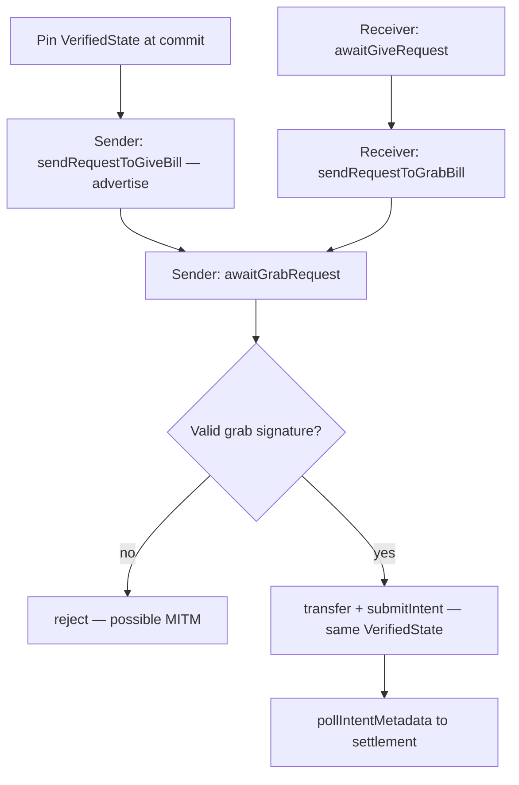

# Payments & Operations

Money movement is the heart of the app. Every payment carries a **server-signed proof** of the exchange rate, submitted over a streaming intent RPC. Face-to-face transfer uses a peer-to-peer rendezvous handshake. External funding (Apple Pay, Coinbase, Phantom) is abstracted behind a `FundingOperation` protocol.

## Payment intents & `VerifiedState`

A payment is submitted via the **`submitIntent` bidirectional stream** (`TransactionService.submit`, `callOptions: .streaming`): client sends `submitActions` → server replies `serverParameters` (nonce + blockhash) → client applies, signs, sends `submitSignatures` → server replies `success`/`error`.

`VerifiedState` (`FlipcashCore/.../Models/VerifiedState.swift`) bundles the proofs the server requires:

- `rateProto` — server-signed exchange-rate proof (**always required**)
- `reserveProto?` — reserve-state proof; `nil` for USDF, **mandatory for launchpad currencies** (server rejects without it)
- `serverTimestamp` — the older of the two proof timestamps (staleness anchor)

Freshness: client ceiling `clientMaxAge = 13 min` (2-min buffer under the server's 15-min limit); `SendCashOperation` also pre-flights a 15-min ceiling on the reserve proof before transfer.

### The pin-at-compute invariant
Amount-entry viewmodels (`BuyAmountViewModel`, `CurrencySellViewModel`, `WithdrawViewModel`, `GiveViewModel`, `SendAmountViewModel`) call `prepareSubmission()` **at commit time** to pin the `VerifiedState`, and compute `ExchangedFiat.quarks` against *that same proof's rate*. The pinned state is carried unchanged through `Session.showCashBill → BillDescription.verifiedState → SendCashOperation` / `createCashLink`.

> Using a different (or re-fetched) proof at the transfer step makes `quarks × rate` disagree with what the server validates → "native amount does not match expected value" rejection. Pin once, at compute.

## SendCashOperation — the give/grab rendezvous

`Flipcash/Core/Screens/Main/Operations/SendCashOperation.swift`. The sender's side. `start()` spawns a `Task` (`runTask`); `cancel()` and `isolated deinit` cancel it. `run()` executes two sequential phases sharing one resolved `VerifiedState`:

- **Path 1 — advertise the bill**: resolve the `VerifiedState` (prefer the pinned one from `BillDescription`, else `RatesController` cache), then `client.sendRequestToGiveBill(mint:exchangedFiat:verifiedState:rendezvous:)` publishes the bill on the rendezvous channel.
- **Path 2 — listen → transfer**: `client.awaitGrabRequest(...)` waits for the receiver's grab → verify the destination signature against the rendezvous key (MITM protection) → pre-flight reserve-proof age → `client.transfer(...)` using the **same** `VerifiedState` → `client.pollIntentMetadata(...)` until settlement.

> **Never explicitly `cancel()` or `invalidateMessageStream()` a `SendCashOperation` from `dismissCashBill`.** After a grab, the received bill is a *live* `SendCashOperation` (the "quick give-and-grab" chain — someone can scan it next). Setting `sendOperation = nil` is fine (deinit cleans up); explicit teardown kills a live bill. Teardown is implicit: `run()` returning (success) or throwing (failure) ends the `runTask`, and `deinit`/`cancel()` handle external teardown. `ignoresStream` (set by Session while a share sheet is up) suppresses processing a grab that arrives mid-share.

## ScanCashOperation — the receiver's side

`ScanCashOperation.swift`. `client.awaitGiveRequest(...)` waits for the sender's advertisement (which carries `mint`, `verifiedState`, and `mintMetadata`). Resolves the VM authority (prefers the message's metadata → DB → `fetchMints`), ensures token accounts (`createAccounts`), sends `sendRequestToGrabBill(destination:rendezvous:)`, then `pollIntentMetadata` for settlement. Because both `VerifiedState` and `MintMetadata` come from the sender's advertisement, the scan works even if the receiver never subscribed to that currency's stream.

> Every `showCashBill` must pass `verifiedState` — even for received bills — or launchpad transfers fail with "reserve state is required".

## Funding operations

`FundingOperation` (`FundingOperation.swift`) — single-concern protocol: `start(_ operation: PaymentOperation) async throws -> StartedSwap`, `confirm()`, `cancel()`. Three implementations:

| Operation | When | External step |
|-----------|------|---------------|
| `ReservesFundingOperation` | User has USDF; fund from reserves | none (straight through) |
| `CoinbaseFundingOperation` | Apple Pay onramp (USDF bought via Coinbase) | Apple Pay sheet (WebView) |
| `PhantomFundingOperation` | External Solana wallet | Phantom connect + sign (two deeplink round-trips) |

Notes: both external operations **record the swap server-side before any money moves**. Coinbase rebuilds `ExchangedFiat` from Coinbase's *recorded* purchase amount before submitting (Coinbase's USD→USDF rate differs by 1–2 quarks; using the requested amount would reject). Phantom pre-flights the signed transaction via `rpc.simulateTransaction`.

**`UsdcSweepOperation`** (`Flipcash/Core/Operations/UsdcSweepOperation.swift`) — an `actor` that converts the user's USDC ATA balance to USDF via `statelessSwap`. Called as a one-line fire-and-forget from `AppDelegate` on `.active` (`usdcSweepOperation.start()`, which is `nonisolated`). Re-entrant calls are skipped while a sweep is in flight.

## Rates & verified proofs

`RatesController` (`@Observable`) owns two actors:

- **`LiveMintDataStreamer`** — the bidirectional `streamLiveMintData`; receives `VerifiedCoreMintFiatExchangeRate` and `VerifiedLaunchpadCurrencyReserveState` protos, dispatches them to `VerifiedProtoService`.
- **`VerifiedProtoService`** — caches `exchangeRates` (by currency) and `reserveStates` (by mint); deduplicates rate changes for the publisher (avoids no-op re-renders) but always stores the freshest proof; persists to SQLite (`VerifiedProtoStore`) and warm-loads at init.

Flow into a payment: stream → `VerifiedProtoService` (memory + SQLite) → `RatesController.cachedRates` (display) → at commit, `RatesController.currentPinnedState(for:mint:)` returns the cached `VerifiedState` (rejects stale). Amount-entry uses `verifiedState.rate` (the rate embedded in the proof), **not** the live `cachedRates`, so the server's validation matches. `awaitVerifiedState(...)` polls up to 25× at 200ms, and for non-USDF mints also waits for `reserveProto != nil`.

## After every transaction

`Session.updatePostTransaction()` = `updateBalance()` + `updateLimits()` + `historyController.sync()`. **Call it after any operation that moves funds** — buy, sell, withdraw, launch, transfer, receive, cash-link, and on push-triggered receipt.

## Swaps

`SignedSwapResult` is the typed callback result from external funding: `.buyExisting(swapId:)` or `.launch(swapId:, mint:)`. The `statefulSwap` stream (`SwapService`) is used for buy/sell/withdraw (build + sign the swap transaction, then `submitIntent` Phase 2 funds it from USDF). `statelessSwap` is single-purpose for the USDC→USDF sweep — no funding intent, no `VerifiedState`.
