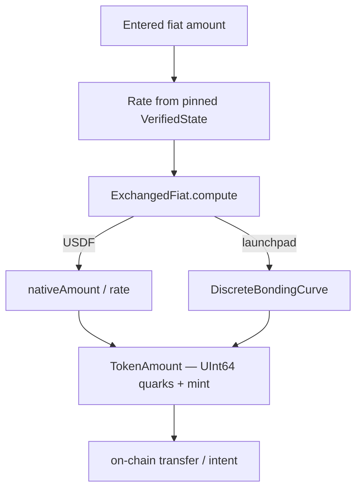

# Currency & Domain Model

The domain layer lives in `FlipcashCore/Sources/FlipcashCore/Models/`. It keeps money exact (integer quarks + `Decimal` fiat), travels mint identity with every amount, mirrors the on-chain bonding curve precisely, and routes validation and errors through single sources of truth.



## Money primitives

- **`TokenAmount`** (colloquially "Quarks") — `(quarks: UInt64, mint: PublicKey)`. A quark is the smallest on-chain integer unit. USDF has `mintDecimals = 6`; **all other mints (including USDC) have `mintDecimals = 10`**. `decimalValue = quarks.scaleDown(mint.mintDecimals)` is integer-only — no floats. Cross-mint arithmetic is a `precondition` crash, so mint identity can never be lost.
- **`FiatAmount`** — `(value: Decimal, currency: CurrencyCode)`. Human-facing money; base-10 exact `Decimal` math; cross-currency arithmetic also `precondition`-guarded.
- **`ExchangedFiat`** — the bridge between the two worlds: `onChainAmount: TokenAmount` (integer quarks for the SPL transfer), `nativeAmount: FiatAmount` (what the user sees), `currencyRate: Rate`, and a computed `usdfValue`. Built via `init(nativeAmount:rate:)` for USDF or `compute(fromEntered:rate:mint:supplyQuarks:)` for bonded mints. Money stays in `UInt64` quarks / `Decimal` throughout, so there's no float error.
- **`Rate`** — `(fx: Decimal, currency: CurrencyCode)`, always native-per-USD; `Rate.oneToOne` is USD identity.

## Currencies & mints

- **`CurrencyCode`** — `enum: String` of ~160 ISO fiat codes (the *display* currency, not a mint). Exposes `maximumFractionDigits` (ICU-resolved, cached behind a lock to avoid main-thread hangs), single-char symbols, and a `region` for flags.
- **`MintMetadata`** — rich per-mint info: address, decimals, name, symbol, image, optional `VMMetadata` (timelock VM authority + lockout), optional `LaunchpadMetadata` (bonding-curve state: config, liquidity pool, seed, authority, vault/fee addresses, `supplyFromBonding`, `sellFeeBps`, price/market-cap). `.usdf` and `.usdc` are static singletons.
- A mint **is a launchpad/custom currency iff `launchpadMetadata != nil`** — those require the `reserveProto` for payments.
- Constants (`PublicKey+Definitions.swift`): `PublicKey.usdf`, `PublicKey.usdc`. `PublicKey.mintDecimals` has a single branch — `.usdf → 6`, **everything else (including `.usdc`) → 10**. USDC's real 6-decimal precision comes from `MintMetadata.usdc.decimals`, not from `PublicKey.mintDecimals`.

## Bonding curve

**`DiscreteBondingCurve`** mirrors the Solana program exactly so client and server price identically. Step-based:

| Constant | Value |
|----------|-------|
| `maxSupply` | 21,000,000 tokens |
| `stepSize` | 100 tokens/step |
| `tableSize` | 210,001 entries |
| `decimals` | 10 |
| price range | ~$0.01 → ~$1M at max supply |

The pricing and cumulative-cost tables are pre-computed and shipped as binary `.bin` resources (loaded at runtime — large array literals blow up the Swift compiler). Operations: `spotPrice(at:)`, `buy(usdcQuarks:feeBps:supplyQuarks:)`, `sell(tokenQuarks:...)`, `tokensForValueExchange(fiat:fiatRate:supplyQuarks:)`. `ExchangedFiat` holds a private curve instance and delegates its `compute(...)` factories to it.

## Account clusters & keys (Solana)

- **`AccountCluster`** — groups the keys for one mint+user: an `authority: DerivedKey` (Ed25519 from the mnemonic via BIP-44) plus `timelock` PDAs for the USDF timelock VM. Exposes `authorityPublicKey`, `vaultPublicKey`, `depositPublicKey`. `use(mint:)` reuses the authority for a different token.
- **Derivation** — BIP-44 paths off the mnemonic (`Derive.Path`): primary `m/44'/501'/0'/0'`, pool `…/7665'/<index>`, rendezvous pool `…/2335'/<index>`, relationship `…/0'/0` with a domain password. `LaunchpadMint` PDA helpers mirror the server's `pda.rs` to derive mint/config/pool/vault from `(authority, name, seed)`.

(Crypto internals — CodeCurves, programs, transaction building — are covered in [09](09-cross-cutting-concerns.md).)

## Error model

**`ServerError`** (`ServerError.swift`):

```swift
public enum ErrorReportingLevel: Sendable, Equatable {
    case suppressed   // never sent — network weather, success sentinels
    case info         // Bugsnag info severity — expected business outcomes (denied, not-found, rate-limited)
    case error        // Bugsnag error severity — client/proto defects (unrecognized codes, parse failures)
}

public protocol ServerError: Error {
    var reportingLevel: ErrorReportingLevel { get }
}
```

There is **deliberately no protocol default** — every conformer classifies each case explicitly; a defaulted level would let a forgotten or drifted conformance compile while silently muting its errors. ~35 service error enums conform; each has cases per gRPC result code plus a `.unknown` for unrecognized values (client/server drift) — `.unknown` is the canonical `.error`-level case.

**`TransportClassifiableError`** (`TransportClassifiableError.swift`) refines `ServerError` for enums whose failure can be a transport condition rather than a server result code: it requires static `.transportFailure` (which the conformer maps to `.suppressed`) and `.unknown`, and the single shared `from(transportError: RPCError)` default maps transient codes (`RPCError.Code.isTransientNetworkError` — deadline expired / unavailable) to `.transportFailure` and everything else to `.unknown` — no per-enum mapping. `RPCError` itself conforms to `ServerError` (`RPCError+Extensions.swift`): transient → `.suppressed`, `.cancelled` → `.info` (app-initiated teardown), all other codes → `.error` — so unary RPCs that ship the existential `Error` classify correctly with no per-call-site mapping. `FlipcashCoreTests/TransportClassificationTests` asserts every conformer is wired.

The level is **enforced in one place**: `ErrorReporting.capture(_:)` (`Flipcash/Utilities/ErrorReporting.swift`) reads `(error as? ServerError)?.reportingLevel ?? .error` (an unclassified error is treated as a real bug), returns without sending on `.suppressed`, and maps `.info`/`.error` onto Bugsnag severities. Call sites always call `captureError` unconditionally and never re-check the level.

## Validation

**`Validator`** (`Validation/Validator.swift`):

```swift
public protocol Validator<Output>: Sendable {
    associatedtype Output: Sendable
    func validate(_ input: String) -> Output?   // canonical form, or nil
}
```

One concrete validator per input type owns the rule, returns the canonical `Output`, and is unit-testable in isolation. Five validators today:

| Validator | Output | Rule |
|-----------|--------|------|
| `EmailValidator` | `String` (trimmed) | PGV regex from `email/v1/model.proto`, max 254 bytes |
| `PhoneValidator` | `Phone` | PhoneNumberKit parse, then E.164 checked against the PGV rule from `phone/v1/model.proto` |
| `CurrencyNameValidator` | `String` (unchanged) | printable ASCII, no leading/trailing space, 1–32 chars; rejects rather than trims — the moderation attestation is bound to the exact string |
| `LengthValidator` | `String` (unchanged) | non-blank, `maxLength` cap |
| `AmountValidator` | `Decimal` | canonicalises the locale decimal separator to `.` before parsing — `Decimal(string:)` alone stops at "," and silently drops the fraction |

**Submit the validator's `Output`, not the raw input** — that makes trim/regex divergence structurally impossible. Client rules must mirror the server PGV regex; inline regex/trim/length checks in viewmodels are forbidden because they drift the moment the proto changes. **Any string bound to `KeyPadView`/`EnterAmountView` is parsed exclusively by `AmountValidator`** — never raw `Decimal(string:)` or `NumberFormatter.decimal(from:)`.

## Formatters

`Formatters/`: `NumberFormatter.fiat(...)` (locale-aware, cached behind a lock, manual single-char currency prefix, half-up rounding / `.down` when truncated) backs `FiatAmount.formatted`. `CompactCurrencyFormatStyle` renders `$1M`/`$690K` for market-cap/supply. `DateFormatter` extensions provide tiered relative dates (time today → Today/Yesterday → full weekday name within 6 days → `EEE, MMM dd` for older).

> **Keypad amount strings use the locale's decimal separator** (`AmountValidator.localizedDecimalSeparator`, `.` as fallback) — not a hardcoded `.`. Any parser consuming `KeyPadView` output must go through `AmountValidator`, which normalizes the separator before parsing.
