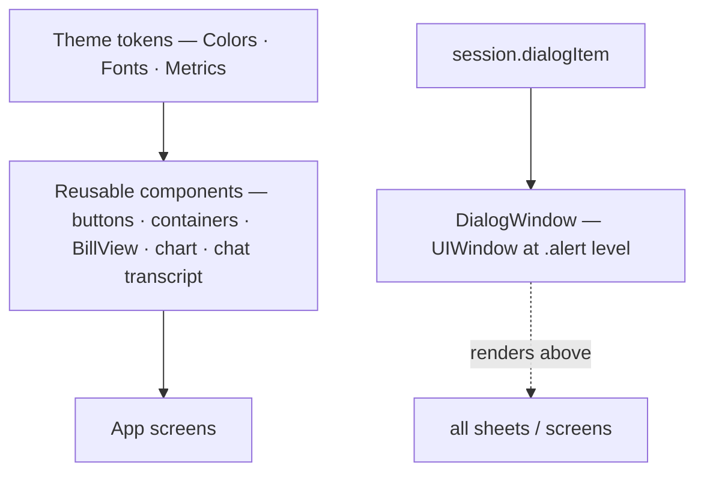

# Design System (FlipcashUI)

`FlipcashUI` is the reusable component library and design-token layer. It imports `FlipcashCore` for model types and formatters (e.g. `FiatAmount`, `CurrencyCode`) but contains **no networking, persistence, or session state**. Its only third-party dependencies are `ChatLayout` and `DifferenceKit`, for the chat transcript. All files default to `@MainActor` isolation; minimum iOS 18.

## Design tokens

- **Colors** (`Theme/Colors.swift`) — exposed as dot-syntax statics on `Color`/`ShapeStyle`, no `Theme` type. Categories: text (`.textMain`, `.textSecondary`, `.textAction`, `.textError`/`Success`/`Warning`), action (`.action`, `.actionDisabled`), background (`.backgroundMain`, `.backgroundRow`, `.rowSeparator`), banners, and a `Color.Sentiment` family (positive/negative/neutral). Plus `Color(hex:)` / `.hexString` helpers. Named dynamic color assets (`background`, `backgroundSecondary`, `error`, `success`) live in the app's `Assets.xcassets/Colors/`, referenced by name.
- **Typography** (`Theme/AppFonts.swift`, `FontBook.swift`) — primary face **AvenirNextLTPro**; `FontBook.registerApplicationFonts()` registers fonts at launch. Named scale tokens on `Font`/`UIFont`: `appDisplayLarge` (55) → `appDisplayXS` (20), `appTitle`, `appTextXL`→`appTextCaption`, `appKeyboard`, `appTextAccessKey`.
- **Spacing/metrics** (`Metrics.swift`) — `enum Metrics`: `buttonHeight` 60 / `buttonHeightThin` 44, `buttonRadius` 6, `boxRadius` 12, `buttonPadding` 20, plus input-field stroke/border helpers.

## Component catalog

- **Button styles** (`.buttonStyle`): `.filled` / `.filledCompact` / `.filled20`, `.subtle`, `.icon(asset)`, `.card(icon:)`, and version-gated `.liquidGlassButtonStyle(shape:)` (glass on iOS 26, `.ultraThinMaterial` below).
- **Buttons**: `CapsuleButton`, `LargeButton`, `BubbleButton`, `DialogButton` (`.primary`/`.secondary`/`.destructive`/`.outline`/`.subtle`, with `.loading`/`.success` states). `CodeButton` is deprecated.
- **Toolbar**: `CloseButton` — `xmark` in `.topBarTrailing`. **This is the project's standard sheet-dismiss affordance** (not Apple's `Button("Cancel")`); don't flag it as Apple-divergent.
- **Containers**: `Background`, `BorderedContainer`, `InputContainer`, `PartialSheet` (content-sized detents), `GlassContainer`, `LazyTable` (parallax header), `VerticalContainer` (rotated children), `ToastContainer`, `Loadable`.
- **Controls**: `SwipeControl` (slide-to-confirm, idle-nudge), `KeyPadView` (numeric; the decimal key inserts `AmountValidator.localizedDecimalSeparator` from `FlipcashCore` — the device locale's separator, `.` as fallback — so keypad strings are parsed with `AmountValidator`).
- **Bill**: `BillView` (full cash-bill renderer — gradient, security strip, textures, rotated labels, centered code; `drawingGroup`), `CodeView`, `KikCode` (pure-Swift circular code generator — independent of the `CodeScanner` package).
- **Chart**: `StockChart` (+ `ChartViewModel`), `ChartLineView`, `ChartRangePicker` (1D/1W/1M/1Y/all).
- **Contacts**: `ContactAvatarView` (image or monogram, `NSCache`-backed), `ContactsAuthorizer` (`@Observable` permission-state wrapper, mirrors `CameraAuthorizer`).
- **Chat** (`Chat/`): `ChatViewController` — a `ChatLayout`-backed `UICollectionViewController` transcript; dumb and push-driven (`update(items:)` with DifferenceKit diffing, older pages requested via `onReachTop`). `ChatScreenViewController` composes it with two injected SwiftUI bars — a resting bar pinned to the safe area and a composer pinned to the keyboard layout guide. Cells: `ChatMessageCell`, `ChatCashCardCell`, `ChatDateSeparatorCell`, `ChatTypingIndicatorCell`, plus `ChatBubbleView`/`ChatReceiptLabel`.
- **Misc**: `AmountText`/`AmountField`, `ImmutableField`, `Flag`, `Badge`/`Bubble`/`BadgedIcon`, `QRCode`, `TwoFactorCodeView`, `CheckView`, `LoadingView`/`CircularLoadingView` (both `ProgressView`-backed — circular-styled and a custom determinate ring style respectively), `ExpandableText`, `TextBubble`, `AccessKey`, `ValueAppreciation`.
- **List**: `ListHeader`, `Row` (insets, `.chevron`/`.loader` accessory, auto separator).
- **Modifiers**: `.pill(_:)` (compact pill label inside a tappable row), `.vSeparator` (pixel-precise hairline), `.if(condition:)`, `.liquidGlassButtonStyle`.

## Dialog system

`Dialog/`. `DialogItem` is `Identifiable` with a `style`, title/subtitle, and `[DialogAction]` built via `@ActionBuilder`. Factories: `.error` (red, tracked), `.alert` (red, untracked), `.info` (grey), `.success` (grey — same `backgroundSecondary` as `.info`, non-dismissable by default).

> `.dialog(item:)` is `.sheet(item:)` under the hood. Binding the same `dialogItem` to two live views triggers UIKit's "only one sheet" warning. **`DialogWindow` (in the app target) hosts `session.dialogItem` in a separate `UIWindow` at `.alert` level**, so it renders above every sheet without joining the main presentation queue. Use `session.dialogItem` for any dialog that must fire across a sheet boundary; a local `@State DialogItem?` bound by exactly one view is fine.

## Camera & scanning UI

`Camera/`. `CameraSession<T: CameraSessionExtractor>` is a generic `@MainActor` class managing the `AVCaptureSession`; it publishes extracted frames via Combine subjects. The `CameraSessionExtractor` protocol is the extension point — the app's `CodeExtractor` (using the `CodeScanner` package) decodes KikCodes from sample buffers. `CameraViewport`/`CameraPreviewView` wrap an `AVCaptureVideoPreviewLayer` (the underlying preview view is a **singleton** — one live preview at a time) with pinch-zoom and tap-to-focus. `CameraAuthorizer` (`@Observable`) wraps permission state.

## UIKit bridges

The chat transcript (`Chat/` — `UICollectionViewController` + `ChatLayout`, the package's largest UIKit surface), `View Controllers/SafariView.swift` (`SFSafariViewController`), `CameraPreviewView` (`AVFoundation`), plus direct UIKit use in `ContactAvatarCache` (`NSCache`/`UIImage`), `QRCode` (CoreImage), `KikCode` (`UIBezierPath`), `Haptics`, and `FontBook`. App-level UIKit (AppDelegate, navigation) lives in the app target.

## Conventions

- **No view functions.** Reusable UI is always extracted to a `struct`; `@ViewBuilder` funcs appear only as `private` helpers inside a struct's `body`. There is no such thing as premature view extraction.
- **Modern SwiftUI throughout** — `@Observable`, `@Bindable`, two-closure `onChange(of:initial:_:)`. No `ObservableObject`/`@Published` inside FlipcashUI.
- **Loading uses explicit placeholder data**, not `.redacted(.placeholder)` (under which only geometry — font/frame/length — renders; color and `lineLimit` are suppressed). `Loadable`/`ButtonState.loading`/explicit placeholder `Data` cover the cases.
- **`matchedGeometryEffect` must come *before* `.frame`** in the chain, or hero animations silently fail. `.transition(.identity)` on a parent kills matched-geometry interpolation entirely.
- **Liquid Glass / iOS 26** features are `if #available(iOS 26, *)`-gated with `.ultraThinMaterial` fallbacks.
- **Assets** go through typed enums (`Asset`, `SystemSymbol`) via `Image.asset/.system/.regionFlag`. **Haptics** use named presets (`.tap()`, `.buttonTap()`, `.softest()`…), not raw floats.
