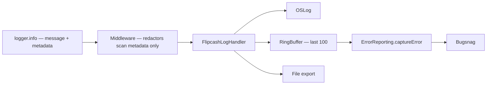

# Cross-Cutting Concerns

Infrastructure that every feature touches: logging (with redaction), error reporting, analytics, cryptography, the circular-code scanner, and build/config plumbing.

## Logging

`FlipcashCore/.../Logging/`, built on **swift-log**. `LogStore.bootstrap` registers one `FlipcashLogHandler` for all labels; it processes each entry once and fans out to three sinks:

- **OSLog** — `os.Logger(subsystem: bundleId, category: label)` for Console.app / Instruments.
- **RingBuffer** (capacity 100) — drained by `ErrorReporting` to attach recent logs to every crash.
- **File** — batched writes to `Caches/Logs/`, exported as one `.log`.

A **middleware pipeline** runs before the sinks (each gets `inout LogEntry`, returns `false` to drop):

- `PatternRedactor` — scrubs **metadata values** matching base58 keys, emails, phone numbers (bare all-digit strings are exempt so quark counts survive).
- `SensitiveKeyRedactor` — replaces values whose **key** contains `token`/`key`/`secret`/`password`/`seed`/`mnemonic`/`phone`/`email` with `[REDACTED]`.

> Both redactors scan **only `entry.metadata`**, never the message string. Hence the rule: **the message is a constant; every variable goes in structured `metadata`.** This gives all values the redactor safety net and keeps logs queryable (`grep owner=`). Never log a proto blob whole (`\(response)` recursively serializes base58 fields) — extract the specific count/type/error you need. Labels follow `flipcash.<domain>` (`flipcash.router`, `.session`, `.database`, `.send-cash`, `.rates-controller`, …).

## Error reporting

`Flipcash/Utilities/ErrorReporting.swift`, backed by **Bugsnag**. `ErrorReporting.captureError(_:reason:id:metadata:)` takes any error **unconditionally**; the private `capture(_:)` centralizes the `isReportable` filter (a `ServerError` with `isReportable == false` returns early). Survivors are wrapped, enriched with `file:function:line`, caller metadata, and the last 100 ring-buffer lines; the **grouping hash is `fileName:function`** (no line numbers, so it survives refactors). `capturePayment(...)` helpers attach rendezvous/exchange context. Identity (hex `UserID`) is shared with Mixpanel.

> Call `captureError` directly — never gate on `isReportable` at the call site (that's dead code that drifts). Every crash fixed from Bugsnag gets a regression test in `FlipcashTests/Regressions/Regression_{id}.swift`. CI uploads dSYMs in `ci_scripts/ci_post_xcodebuild.sh`.

## Analytics

`Flipcash/Utilities/Analytics.swift` + `Events.swift` + `Analytics+ErrorModal.swift`, backed by **Mixpanel** (identity shared with Bugsnag). Single entry point `Analytics.track(event:properties:error:)`. Event domains: `General`, `Account`, `Button`, `Transfer` (grab/give/withdraw/cash-link), `Onramp`, `Send`, `Wallet`, `TokenInfo`, `TokenTransaction`, `CurrencyLaunch`, `Deeplink`, `Error`. Standard properties: `state`, `quarks`, `mint`, `fiat`, `currency`, `fx`, `screen`, `callSite`. Every error dialog shown to a user is tracked via `errorModalDisplayed(...)`.

## Cryptography

- **CodeCurves** — pure-C Ed25519 (`keypair.c`, `sign.c`, `verify.c`, `ge/fe/sc.c`, `sha512.c`). The Swift layer is a thin `KeyPair` (`init(seed:)`, `sign(_:)`) over the C header.
- **Solana keys** (`FlipcashCore/Solana/Keys/`) — `PublicKey = Key32`, `Signature = Key64`, etc. (fixed-length byte arrays with base58). `Derive` does SLIP-0010/BIP-39: phrase → PBKDF2-SHA512 seed → HMAC-SHA512 master → hardened child per path → `KeyPair`. `AccountCluster` bundles a derived authority + timelock PDAs per mint. `Mnemonic` handles BIP-39 entropy↔phrase.
- **Solana programs** (`Solana/Programs/`) — client-side transaction construction, no Solana SDK: `SystemProgram`, `TokenProgram`, `AssociatedTokenProgram`, `MemoProgram`, `TimelockProgram`, `VMProgram`, `CurrencyCreatorProgram`, `SwapValidatorProgram`, etc. `SwapInstructionBuilder` assembles multi-instruction transactions (buy/sell/newCurrency/statelessSwap/usdc↔usdf); `TransactionBuilder`/`VersionedMessageV0` serialize to wire format.
- **Signing flow** — `KeyPair.sign` produces the signature attached to every gRPC request (see [04](04-networking.md)) and to payment transactions (the bytes from `SwapInstructionBuilder`), alongside the server-signed `VerifiedState`.

## CodeScanner (Kik Codes)

A separate C++/OpenCV framework that encodes/decodes/scans circular 2D codes; bundles OpenCV 4.10 + a ZXing Reed-Solomon subset. ObjC API `KikCodes` (`+encode`, `+decode`, `+scan:width:height:quality:`). Consumers:

- **`CodeExtractor.swift`** — live camera: extracts the YUV plane (vImage/Accelerate), `KikCodes.scan(quality: .best)` → `KikCodes.decode` → `CashCode.Payload`; uses a `RedundancyContainer` (1-scan confirmation). Still image: all quality levels, then a 5×5 sliding-window fallback.
- **`CashCode.Payload+Encoding.swift`** — `payload.codeData()` → `KikCodes.encode` for the rendered scan target. The 20-byte payload is `[type:1][currency_index:1][fiat_scaled:8][nonce:10]` (the fiat field is an 8-byte slot; encode writes 7 significant bytes, leaving the high byte zero).

Updating OpenCV: `cd CodeScanner && ./Scripts/build_opencv.sh --version <v>`.

## Build & config infra

| File/Dir | Purpose |
|----------|---------|
| `Configurations/base.xcconfig` | Includes `secrets.xcconfig` then `secrets.local.xcconfig` (local override wins) — all API keys in secrets files, never in source |
| `Scripts/build.sh` | `xcodebuild` wrapper for the `Flipcash` scheme; `--device [name]` resolves a paired iPhone UDID via `devicectl` |
| `Scripts/test.sh` | Targeted simulator test runner (iPhone 17); disables clone-spawning parallelism; no `AllTargets` |
| `Scripts/run` | Proto regeneration: pulls `.proto`, runs `protoc` + plugins (grpc-swift **v1**), writes `Generated/` |
| `ci_scripts/ci_post_xcodebuild.sh` | Xcode Cloud: uploads dSYMs to Bugsnag on successful archives |
| `fastlane/Fastfile` | `release` lane: submits a tagged build to App Store Review |

## Shared utilities

`FlipcashCore/Utilities/`: `Poller` (cancellable repeating async task, awaits each tick), `Keychain` (Security.framework wrapper), `InfoPlist` (typed plist access), `Queue` (blocked/unblocked action queue), `DataPointResampler` (chart resampling). `Extensions/`: `Task.retry`/`Task.delay`, `Data+Hex`/`+Slice`, `Decimal`/`BigDecimal` operations, `FixedWidthInteger+Bytes` (Solana wire serialization), `KeyPair+Rendezvous`, `GRPCStatus+Extensions` (status → `ServerError`).
