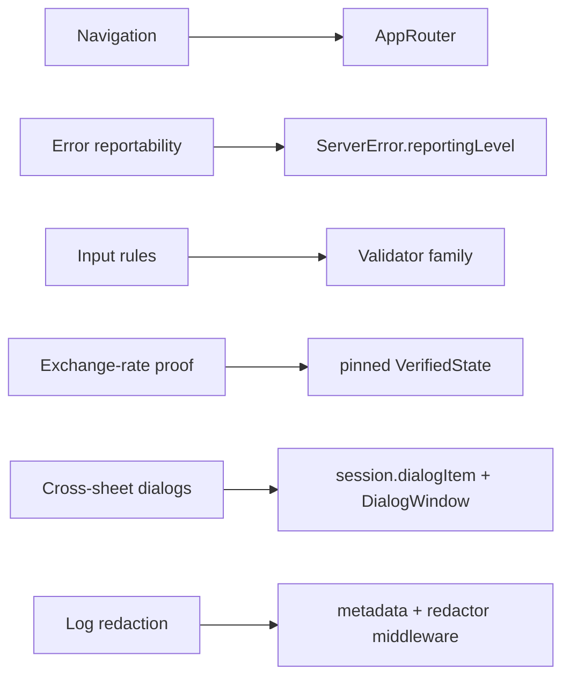

# Separation of Concerns

The principles that hold the architecture together. The other docs describe *what* each part is; this one describes *why the seams are where they are* and the single-source-of-truth rules that keep them clean.

*Each concern routes to exactly one owner — never re-implemented at the call site.*

## 1. Strict, acyclic module layering

The dependency graph only ever points down (see [01](01-modules-and-boundaries.md)): app → UI → Core → API → leaf crypto/scanning. The payoff is **bounded blast radius** — a proto change can't reach a screen except through a service wrapper; a UI tweak can't touch business logic; generated code is sealed behind one package. Each boundary is also a *capability* boundary: Core can't render, UI can't fetch, the scanner can't see the network.

## 2. MVVM, but only where it earns its keep

- **ViewModels** exist for multi-screen flows, async-operation coordination, or complex state (onboarding, verification, buy/sell/swap, withdraw, send-amount, currency creation).
- **Standalone, self-contained screens** use `@State` + `@Observable` directly and make router calls inline in their action closures (balance, settings, deposit, discovery, most modals).

The test is *complexity and reach*, not *every screen gets a VM*. See the [feature catalog](features/README.md) for which features fall on which side.

## 3. One source of truth per concern

The codebase repeatedly chooses a single canonical place for a decision, then forbids duplicating it at call sites:

| Concern | Single source | Call sites must NOT… |
|---------|---------------|----------------------|
| Navigation | `AppRouter` | …keep `@State` sheet flags or `selectedXxx` bindings |
| Error reportability | `ServerError.reportingLevel` | …re-check `reportingLevel` before `captureError` |
| Input rules | the `Validator` family — one concrete validator per input type (`AmountValidator` for entered amounts) | …inline regex/trim/length checks |
| Exchange-rate proof | the pinned `VerifiedState` | …re-fetch or pin a second proof mid-flow |
| Cross-sheet dialogs | `session.dialogItem` + `DialogWindow` | …bind the same `DialogItem` to two live views |
| Log redaction | metadata + redactor middleware | …interpolate variables into the message string |

When you find yourself re-implementing one of these at a call site, that's the smell — route through the canonical owner instead.

## 4. State ownership is layered and scoped

State is owned at the narrowest scope that still satisfies its readers:

- **Process scope** → `Container` (clients, account manager, preferences).
- **Login scope** → `SessionContainer` (Session + controllers + database + router), torn down on logout — e.g. chat's `ConversationController` (DM feed + live event stream) and its sibling `ChatSpotlightIndexer` live here, not as methods on `Session`.
- **Transactional concerns** → `Session` (the network/transaction API surface) — but kept from sprawling: new concerns become **sibling controllers** (non-transactional) or **namespaced services** (transactional), never flat methods on `Session`.
- **Screen scope** → `@State` view models / local state.

Reactive flow is uniform: SQLite is the cache of record, `Updateable<T>` republishes DB changes into `@Observable` slots, and views observe without polling.

## 5. The wire contract is the spec — mirror it, don't reinvent it

Client behavior is anchored to the server's contract, not to local convenience:

- Validators mirror server **PGV regexes**; the bonding curve mirrors the server's **Rust program** (identical pricing tables); amounts are computed against the **server-signed rate proof** the server will validate.
- Generated proto code is never edited; service wrappers adapt it. When a proto changes, the canonical client mirror (validator / curve / model) updates in one place.
- Every request is **self-authenticating** (Ed25519 signature in the payload) — auth is a property of the message, not a session token to manage.

## 6. Recoverable cache vs durable secret

A hard split governs where data lives (see [05](05-persistence.md)): anything the server can re-send is a **disposable SQLite cache** (so schema changes just rebuild it — no migrations); only true secrets go in the **Keychain**; only preferences go in **UserDefaults**. This is why "no schema bump / no migration" is treated as an *anti-signal* when planning — it usually means a concern is being put in the wrong layer.

## 7. Platform-idiomatic, modernizing incrementally

New and isolated code uses modern Swift/SwiftUI (`@Observable`, `@Environment`, structured concurrency, modern `onChange`); legacy `ObservableObject` types (`Client`, `FlipClient`) stay until all their consumers migrate, because mixing observation systems on one type fails silently. UI leads with Apple-canonical / HIG-aligned APIs, with a few documented, deliberate deviations (e.g. the `CloseButton` "X" instead of a "Cancel" button). The bias is *gradual migration in the direction of the platform's grain*, not big-bang rewrites.

---

**In one sentence:** every concern has exactly one home, the homes are layered so dependencies only point downward, and the client is a faithful mirror of the server's wire contract.
