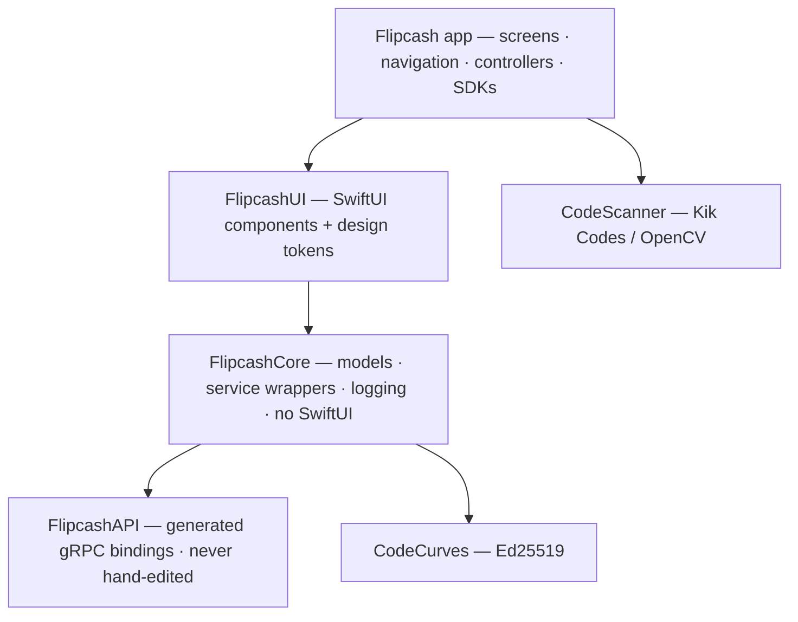

# Flipcash iOS — Architecture

A map of how the app is put together. Each document classifies one architectural concern; read this index first, then jump to whatever you need.

> These docs describe **structure and intent**, not every line. When a doc and the code disagree, the code wins — fix the doc. When you change a subsystem, update its doc in the *same* change (see the **Architecture Docs** rule in [CLAUDE.md](../../CLAUDE.md)), and run `/verify-architecture-docs` to fact-check a doc against the code.
>
> Items tagged ***(contact-sync)*** describe the in-flight `feat/contact-sync` epic and are **not yet on `main`** — remove the tags when the epic merges.

## The 30-second picture

Flipcash is a multi-currency crypto wallet. Users hold balances in **USDF** (a USD stablecoin) and in **launchpad currencies** (custom tokens priced by an on-chain bonding curve). The core interaction is **face-to-face cash transfer**: one device shows an animated circular "cash bill" (a Kik Code) on its camera screen; another device scans it; a peer-to-peer rendezvous handshake moves the money. Money can also be sent to phone contacts *(contact-sync)*, bought via Apple Pay / Coinbase / an external Solana wallet, and withdrawn on-chain.

The app talks to **two gRPC backends** (a payments/OCP server and the Flipcash core server) plus the **Solana** network. Every payment carries a **server-signed proof** of the exchange rate. All state is **cached locally in SQLite**, secrets live in the **Keychain**, and the UI is **SwiftUI** built on `@Observable`.

## Module layering

*Arrows point to dependencies (depends-on / imports).*

The graph is strictly acyclic — nothing reaches "up" toward the app. See [01-modules-and-boundaries](01-modules-and-boundaries.md).

## Documents

| # | Document | Covers |
|---|----------|--------|
| 01 | [Modules & boundaries](01-modules-and-boundaries.md) | The 7 modules, dependency graph, what each owns, enforced boundaries |
| 02 | [State & dependency injection](02-state-and-dependency-injection.md) | `Container`, `SessionContainer`, `Session`, auth lifecycle, `@Observable` model |
| 03 | [Navigation](03-navigation.md) | `AppRouter`, sheets, stacks, nested sheets, deeplinks |
| 04 | [Networking](04-networking.md) | gRPC transport, service layer, call options, streaming, request signing, Solana RPC, push |
| 05 | [Persistence](05-persistence.md) | SQLite (cached server data), Keychain, UserDefaults, schema, no-migration policy |
| 06 | [Payments & operations](06-payments-and-operations.md) | Intents, `VerifiedState`, the give/grab rendezvous, funding operations, swaps |
| 07 | [Currency & domain model](07-currency-and-domain-model.md) | Quarks, fiat, `ExchangedFiat`, bonding curve, account clusters, errors, validation |
| 08 | [Design system](08-design-system.md) | FlipcashUI theme tokens, component catalog, dialogs, camera, conventions |
| 09 | [Cross-cutting concerns](09-cross-cutting-concerns.md) | Logging, error reporting, analytics, crypto, scanning, build/config infra |
| 10 | [Separation of concerns](10-separation-of-concerns.md) | The principles that tie it together — layering, MVVM, single-source-of-truth rules |
| — | [Feature catalog](features/README.md) | Every user-facing feature: purpose, screens, viewmodels, MVVM pattern |

## Reading order by goal

- **New to the codebase** → README → 01 → 02 → 10, then the feature catalog.
- **Adding a screen/feature** → feature catalog → 03 (navigation) → 08 (components) → 02 (where state lives).
- **Touching money movement** → 06 → 07 → 04.
- **Backend/proto change** → 04 → 05 (schema/version bump) → 07.
