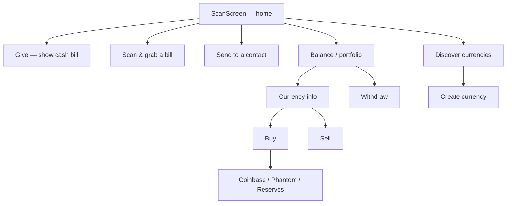

# Feature Catalog

Every user-facing feature, grouped by area. Each entry: purpose · key screen(s)/viewmodel(s) · the MVVM pattern it uses · notable router/operation integration. Screens live in `Flipcash/Core/Screens/`.

The dominant convention (per [10 — Separation of Concerns](../10-separation-of-concerns.md)): **ViewModels appear only for multi-step flows or async-operation coordination; single-purpose display screens use `@State` + `@Observable` directly** and call the router inline.

---

## A. Onboarding & Auth

| Feature | Purpose | Screens / VM | Pattern |
|---------|---------|--------------|---------|
| **Intro / Splash** | Entry point; animates into login or recovery | `Onboarding/IntroScreen` | screen-local |
| **Login** | Phone-number auth / account creation | `Onboarding/LoginScreen` | screen-local |
| **Access Key** | Show/enter the 12-word Ed25519 seed (+ help) | `AccessKeyScreen`, `AccessKeyHelpScreen` | screen-local |
| **Notification permission** | Request push permission (+ denied recovery) | `NotificationPermissionScreen`(+`Denied`) | screen-local |
| **Onboarding flow** | Coordinates access key → contacts → phone → notifications | `OnboardingViewModel` (`@Observable`) | **VM-driven** (owns a child `PhoneVerificationViewModel`) |
| **Email verification** | Enter email → confirm code; also a Coinbase gate | `EnterEmailScreen`, `ConfirmEmailScreen` · `EmailVerificationViewModel` | **VM-driven** (`EmailVerifying`) |
| **Phone verification** | Enter phone → confirm SMS (+ country picker); gates Send | `EnterPhoneScreen`, `ConfirmPhoneScreen`, `CountryCodeSelectionScreen` · `PhoneVerificationViewModel` | **VM-driven** (`PhoneVerifying`) |
| **Contacts permission** | One-shot contacts grant for Send | `ContactsPermission/ContactsPermissionScreen` | screen-local |
| **Account selection** | List historical accounts w/ balances; switch/delete | `Onboarding/AccountSelectionScreen` | screen-local |

## B. Money movement

| Feature | Purpose | Screens / VM | Pattern & integration |
|---------|---------|--------------|------------------------|
| **Scan / Main camera** | The home screen — decodes circular cash codes + QR links | `Main/ScanScreen` · `ScanViewModel` | **VM-driven**; spawns `SendCashOperation`/`ScanCashOperation`, routes deeplinks |
| **Cash bill** | Animated circular-code bill over the camera (live send/receive) | `Main/Bill/BillCanvas`, `BillState`, `BillValuation` | the give/grab rendezvous (see [06](../06-payments-and-operations.md)) |
| **Give** | Amount entry for a cash-bill give | `Main/GiveScreen` · `GiveViewModel` | **VM-driven**; pins `VerifiedState`, calls `session.showCashBill` |
| **Send (contact)** | Contact picker → amount → SMS-invite or direct transfer | `Send/SendRootScreen`, `RecipientPickerScreen`, `SendAmountScreen` · `SendAmountViewModel` | mixed; root gates contacts/phone-verify; `router.push(.sendAmount)` |
| **Buy** | Amount + method (Apple Pay / Phantom / Coinbase) | `Main/Buy/BuyAmountScreen`, `PurchaseMethodSheet`, `PhantomFlowScreen` · `BuyAmountViewModel` | **VM-driven**; nested `BuyFlowPath`; dispatches the three `FundingOperation`s |
| **Sell** | Sell a custom currency back to USDF via the curve | `CurrencySellAmountScreen`, `CurrencySellConfirmationScreen` · `CurrencySellViewModel`(+`Confirmation`) | **VM-driven**; → swap processing |
| **Swap processing** | Blocking screen during any buy/sell swap; polls state | `Main/Currency Swap/SwapProcessingScreen` · `SwapProcessingViewModel` | **VM-driven**; calls `updatePostTransaction` |
| **Withdraw** | Intro → currency → amount → address → confirm → submit | `Settings/Withdraw/*` · `WithdrawViewModel` | **VM-driven** (injected `pushSubstep` closure) |
| **Deposit (USDC)** | Education → show deposit address (QR + copy) per currency | `Settings/Deposit/DepositScreen`, `DepositCurrencyListScreen`, `Main/Buy/USDCDepositEducationScreen` | screen-local; `router.push(.depositAddress)` |
| **Onramp / Coinbase** | KYC-gated fiat on-ramp; deep-link verification callback | `Onramp/VerifyInfoScreen` · `OnrampVerificationViewModel` | **VM-driven**; `Controllers/Onramp/*` (coordinator, inbox, Coinbase service, Apple Pay overlay) |
| **Transaction history** | List past activities; cancel cash-link | `Main/TransactionHistoryScreen` | screen-local; reads `HistoryController` |
| **Transaction details** | Sheet of one activity's line items | `Main/TransactionDetailsModal` | screen-local (display) |
| **Cash received** | Celebration overlay on grab | `Main/Modals/ModalCashReceived` | screen-local (display) |

## C. Currencies

| Feature | Purpose | Screens / VM | Pattern & integration |
|---------|---------|--------------|------------------------|
| **Currency discovery** | Leaderboard of launchpad currencies | `Main/Currency Discovery/CurrencyDiscoveryScreen` (+rows/skeleton) | screen-local; `MarketCapController`; `push(.currencyInfo)` |
| **Currency info** | Mint detail: price, market cap, socials, buy/sell | `Main/Currency Info/CurrencyInfoScreen` · `CurrencyInfoViewModel` | **VM-driven**; live `Updateable` feed; nested `.buy(mint)` |
| **Currency selection** | Picker for active send/receive currency (+ recents/search) | `Main/Currency Selection/CurrencySelectionScreen` · `CurrencySelectionViewModel` | **VM-driven** |
| **Select currency (balances)** | Owned-balance picker for Give/Send/Withdraw/Buy | `Main/SelectCurrencyScreen` | screen-local |
| **Currency creation wizard** | Launch a new token (name, symbol, image, color, funding) | `Currency Creation/CurrencyCreationScreen`/`Summary`/`Wizard` · `CurrencyCreationState` (`@Observable`) | **VM-driven** step engine; drives `FundingOperation` + onramp |
| **Currency launch processing** | Blocking screen while the launch swap settles | `CurrencyLaunchProcessingScreen` · `CurrencyLaunchProcessingViewModel` | **VM-driven**; `session.showCashBill` on success |
| **Bill designer** | Visual editor for a currency's bill artwork | `Main/Bill Designer/BillDesigner`(+`Overlay`) | reusable component; parent owns state |
| **Color editor** | Gradient picker (presets + custom stops) | `Main/Color Editor/ColorEditorControl`, `CustomPanelView` | screen-local; reusable |

## D. Settings & misc

| Feature | Purpose | Screens / VM | Pattern |
|---------|---------|--------------|---------|
| **Balance** | Top-level multi-currency portfolio + appreciation | `Main/BalanceScreen` | screen-local; `push(.currencyInfo/.discoverCurrencies)` |
| **Settings** | Section list (Deposit, Withdraw, Account, App, Advanced, Beta) | `Settings/SettingsScreen` (+ sub-screens) | screen-local; all `router.push` |
| **Beta flags** | Developer feature-flag toggles | `Settings/BetaFlagsScreen` | screen-local; `BetaFlags` |
| **Access key backup** | Show the 12-word key from Settings | `Settings/AccessKeyBackupScreen` | screen-local |
| **Application logs** | In-app log viewer | `Settings/ApplicationLogsScreen` | screen-local |
| **Download app** | Full-screen prompt for a counterparty to install (over scanner) | `Main/DownloadAppScreen` | screen-local; **router destination** (gets 5-min auto-return) |
| **Force logout / upgrade** | Blocking screens on server demand | `ForceLogoutScreen`, `ForceUpgradeScreen` | screen-local |
| **Quick actions** | Dynamic Home Screen shortcuts (Scan, flag-gated Send) | `Controllers/QuickActionsController` | no screen; deeplinks in |
| **Dialog window** | Hosts `session.dialogItem` above all sheets | `Main/DialogWindow` | infrastructure (see [08](../08-design-system.md)) |
